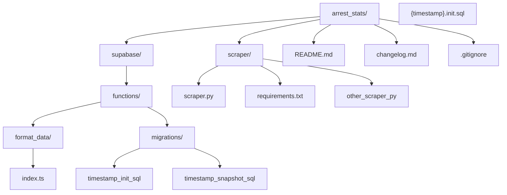

README

ACTIVE DEVELOPMENT

*Arrest Stats is a work in progress. Recent work has focused on data validation.*

Purpose:
1) Create a defensible data pipeline that handles local arrest records through an entire ELT process.
2) Design an application for citizens to query up to date statistics regarding crime and policing in their city.
3) Observe demographic trends to identify potential, relevant areas of concern for government officials and policy makers.  

Priorities:
1) Security: proper authentication and row-level security policies 
2) Privacy: anonymization of records containing personal or identifiable information
3) Data Integrity: strict database definitions
4) Audit Trail: keeping untouched, raw json and hash value of each source 

Current Design Plan:
EXTRACT
1) scraper.py (worker node)
- cron schedule once per hour or on command (import schedule)
- save last_scrape_time from last completed run (confirmed when it receives 200 status from supabase)
- declare .env variables (import dot_env)
- global headers: last_hash_value, last_scrape_time, inmates[], inmate_array 
- def hash(raw_json)
- scrape RECENTS_API and parse json to array (import requests)
- generate hash_value for recents, compare to last_hash, if same end early, update last_scrape_time to now
- try/except array object: determine booking_time from jpg file name, if booking_time later than last_scrape_time add inmate_id to inmates[]
- print length of inmates[]
- for inmates[] scrape url=INMATE_BASE_API{inmate_id}/
- generate hash_value for inmate
- inmate_object(raw_json, hash_value, current timestamp)
- supabase post inmate_array to db raw_arrests table(auth headers)
- supabase response
- if 200: save current time and recents hash_value to last_scrape_time and last_hash_value, print completed at {time}
- if not 200: print error: {supabase response}
2) requirements.txt (pip install for scraper.py)
LOAD
1) table creation
- raw data and hash
- lookup tables (1:N nullable relationships)
- inmate profiles and names
- agency/officer profiles
- arrests
- anonymized table for database queries
2) allow scraper.py to insert array object
- receives inmates_array from scraper.py (verify sender and content)
- immediately inserts to raw_arrests table (primary key, raw_json, hash_value, scraped_at)
TRANSFORM
1) new_arrest_trigger (db trigger)
- wakes format_data up when new row is added to raw_arrests
2) format_data (edge function)
- parse raw_arrests data
- format for arrests table
- insert
3) data validity tests
- VisiData and Soda Core (to enforce guardrails)
4) anonymization step to protect the public facing table
- specifics tbd
5) build frontend tool for data querying
- Export for frontend: Duck DB? or Python?